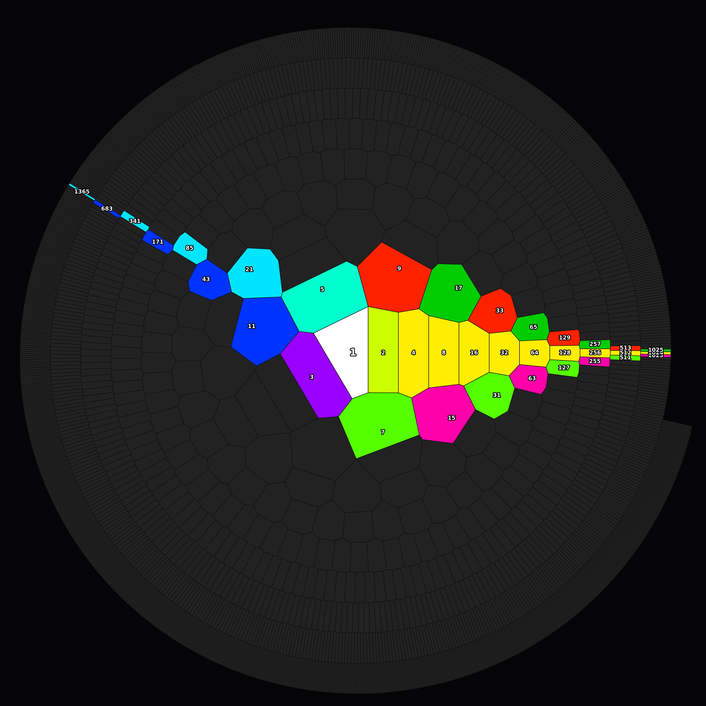

# **Collatz Jacobsthal Topology Visualizer**

Hiroshi Harada — May 23, 2026

[](https://doi.org/10.5281/zenodo.20351182)
[](https://opensource.org/licenses/MIT)
[](https://creativecommons.org/licenses/by/4.0/)

## **Overview**
This project provides a Python toolkit and research reports to geometrically visualize the behavior of natural numbers within the $3n+1$ Collatz map. By mapping natural numbers onto a 2-adic logarithmic spiral space and applying Voronoi tessellation, we demonstrate that a beautifully ordered "stained-glass-like" topology (an RGB color geometric structure) emerges around any arbitrary odd node, governed by seven systems of Jacobsthal ($J$)-type sequences.

## **Gallery**


> **The Stained-Glass Topology of the Collatz Map:**
> Visualization of the natural number space surrounding the final attractor $1 \cdot 2^b$ axis. Mapped onto a 2-adic logarithmic spiral and partitioned via Voronoi tessellation, the space reveals a highly ordered geometric structure governed by seven Jacobsthal-type systems. The cyan trajectory illustrates the final $5 \to 1$ transition of the odd Collatz orbit, landing onto the $1 \cdot 2^b$  axis.

## **Repository Structure**
- `code_01_collatz_voronoi.py`: An introductory script that plots the odd Collatz orbit from any initial value alongside its straight-line trajectory in a Voronoi space.
- `code_02_collatz_jacobsthal.py`: The main script that visualizes the 7-system Jacobsthal topology (RGB color structure) centered around an arbitrary root odd number $M$.
- `REPORT_JP.md` / `REPORT_EN.md`: Research documents detailing the mathematical background and verification of the orbital transitions using the initial value 7.

## **Requirements**
- Python 3.x
- `numpy`
- `matplotlib`
- `scipy`
- `adjustText` (Highly recommended to prevent label overlapping)

To install the dependencies:

```bash
pip install numpy matplotlib scipy adjustText
```

## **Usage**

Running the scripts will generate high-resolution visualization images (PNG) in the current directory. You can customize the target range and root values by modifying the variables in the `CONFIGURATION` section of each script.

```python
# Configuration example in code_02_collatz_jacobsthal.py
TARGET_M = 1       # Target root odd number M (1, 5, 11, 13, 17...)
N_DRAW = 2000      # Range of natural numbers to visualize
```

### ⚠️ **Crucial Note on Selecting the Root Odd Number $M$**

In the inverse Collatz tree structure, multiples of 3 ($M \equiv 0 \pmod 3$) act as "leaves" (endpoints) and do not possess any further odd preimage nodes. Consequently, choosing a multiple of 3 for $M$ forces the true $J$ sequences to consist entirely of fractions, causing the code to yield inaccurate geometric structures due to floating-point rounding adjustments. Always ensure that `TARGET_M` satisfies **$M \equiv 1, 2 \pmod 3$**.

## **License**

* **Research Documents (`REPORT_JP.md`, `REPORT_EN.md`):** [CC BY 4.0](https://creativecommons.org/licenses/by/4.0/)
* **Python Source Code:** [MIT License](https://opensource.org/licenses/MIT)

Copyright (c) 2026 Hiroshi Harada
